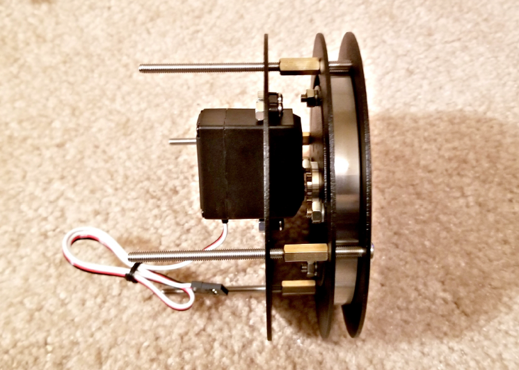

# Подглава 2.2.1 Анатомия робота – из чего они сделаны?

В нашем определении роботами считаются мобильные машины, имеющие датчики, которые взаимодействуют с окружающей средой и имеют стандартный набор компонентов и деталей. Даже сильно отличающиеся внешне роботы, такие как пылесос или самодвижущийся автомобиль, на самом дале состоят из различных версий однотипных компонентов. В некоторых деталей больше, чем в других, но в основном все роботы имеют следующие категории деталей  
_\(Источник: Murphy, Robin R. Introduction to AI Robotics, MIT Press, 2000, Chapter 1\):_

* Контроллер: Устройство, которое отвечает за управление роботом. Это может быть ПК, микроконтроллер, одноплатный компьютер или какое-то другое устройство, способное отправлять и получать команды. Роботы-манипуляторы и некоторые промышленные роботы используют программируемый логический контроллер, позволяющий им работать автономно.
* Станция управления: Роботы предназначены для выполнения задач, требующих участие человека. Люди должны иметь возможность отправлять команды роботам и следить за ними. Чаще всего таким устройством выступает ПК. Станция управления посылает команды роботу и получает от него телеметрию в виде текстовых, видео или аудио данных.
* Радио или канал передачи: Мобильные роботы, подобные тому, что мы создадим в этой книге, способны перемещаться и исследовать окружающую среду. Конечно, робот может получать команды по проводу, однако куда лучше будет использовать радиосвязь. Повсеместное распространение беспроводных сетей, таких как Wi-Fi и сотовая связь значительно упростили создание каналов передачи данных. У меня было много проектов, связанных с роботами, в которых сетевую связь было невозможно использовать, из-за чего приходилось разрабатывать уникальные решения. Другие типы радиомодулей, используемые в роботах, могут включать в себя Bluetooth, Zigbee или другие сетевые протоколы.
* Двигатели: Наше определение робота включает способность к самостоятельному движению, а для этого ему необходимы двигатели. Так, TinMan имеет восемь моторов, два из которых предназначены для перемещения, а шесть управляют рукой. Двигатели, как правило, преобразуют электричество в движении. Из-за их разнообразия выбрать правильные двигатель бывает очень трудно. Необходимо учитывать крутящий момент, количество оборотов в минуту и напряжение. Многие двигатели для роботов оснащены коробками передач для замедления скорости работы, перераспределяя скорость на крутящий момент. Электродвигатели у TinMan имеют редукторные коробки передач.

> Есть и другие способы обеспечить движение робота. Будем называть такие способы эффекторами. Эффекторы ограничены только вашим воображением. Они включают в себя пневматику \(работа за счет сжатого воздуха\), гидравлику \(движение за счет несжимаемой жидкости\), линейные приводы, и даже такую экзотику, как сплав, сохраняющий форму или пьезоэлектрические кристаллы, изменяющие форму при подаче электричества. Существуют роботы-рыбы, роботы-осьминоги, мягкие роботы, катающие роботы, ходящие роботы и другие.

* Серводвигатели: Особая категория двигателей. Серводвигатели имеют механизм обратной связи и контур управления, за счет чего они способны поддерживать положение или скорость робота. Обратная связь обеспечивается датчиком. Серводвигатели, которые мы используем, состоят из небольшого электродвигателя, приводящего в движение редуктор. Редуктор состоит из целого ряда шестерен, которые уменьшают скорость и увеличивают крутящий момент двигателя. Датчик представляет собой потенциометр \(переменный резистор\), способный измерять угол входного зубчатого вала. Когда мы посылаем команду серводвигателю, он сообщает электродвигателю команду, чтобы он установил определенный угол. Угол измеряется датчиком, и любая разница между положением двигателя и датчиком создает сигнал ошибки, который перемещает двигатель в правильном направлении. Вы можете услышать, как мотор издает сильный шум. Это происходит из-за того, что он много раз поворачивает семь редукторов, чтобы заставить рычаг двигаться. Коробка передач позволяет получить сильный крутящий момент, при этом не потребляя много тока.
* Контроллер двигателя: Сами по себе двигатели не очень полезны – необходима возможность преобразовывать команду от управляющего устройства, чтобы привести их в движение. Поскольку двигатели требуют большего напряжения и тока, чем способен выдать наш управляющий компьютер Raspberry Pi, нам необходимо устройство, преобразующие цифровые сигналы в большие аналоговые напряжение и ток. Это устройство называется контроллером двигателя, а иногда и электрическим регулятором скорости. Поскольку наш робот с танковым приводом, нам необходимы двигатели, чтобы двигаться вперед и назад. Контроллер двигателя принимает специальный сигнал, называемый широтно-импульсной модуляцией \(ШИМ\). ШИМ – это повторяющийся сигнал, в котором напряжение возникает и пропадает. Дроссельная заслонка двигателя \(скорость вращение двигателя\) пропорциональна количеству времени, в течение которого ШИМ-сигнал находится во включенном режиме.

